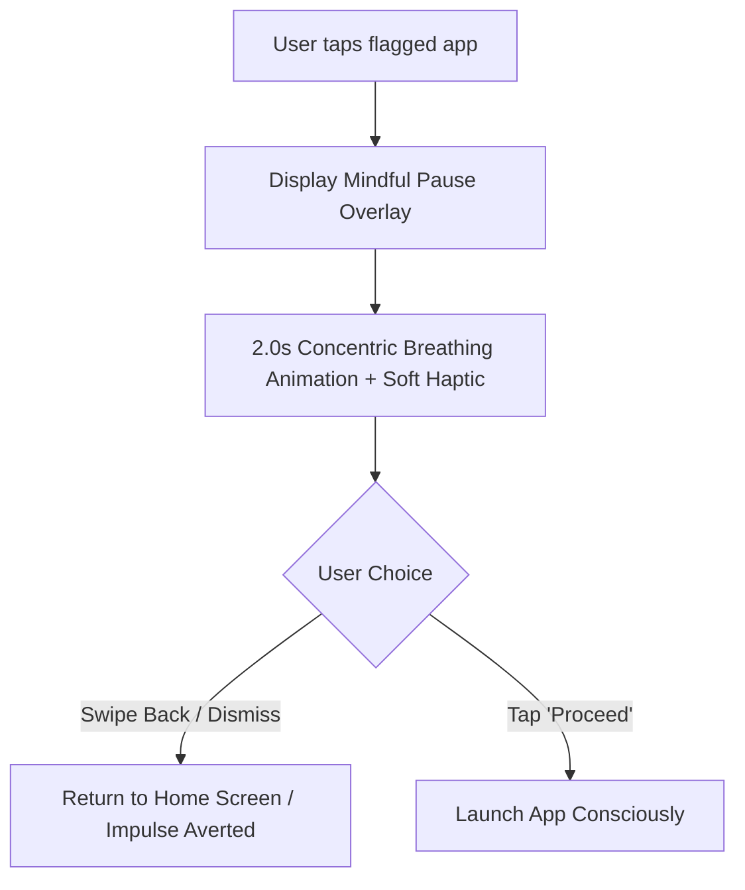

# Product Backlog: Mindful Focus & Pomodoro Integration

| Metadata | Details |
| :--- | :--- |
| **Spec ID** | `SPEC-02` |
| **Feature Title** | Mindful Focus & Pomodoro Integration |
| **Status** | `Ready for Spec` |
| **Priority** | High |
| **Target Component** | Home Header / App Launch Interceptor / Timer Engine |

---

## 1. Problem Statement

Modern smartphone users spend significant mental energy battling digital distractions. However, existing focus solutions suffer from severe structural design flaws:
1. **Punitive & Guilt-Inducing**: Traditional app blockers use hard locks, shame notifications, and aggressive lockouts that generate anxiety rather than mindfulness.
2. **High Friction & Cognitive Overhead**: Most Pomodoro apps require navigating multiple configuration menus, setting up complex category rules, or maintaining separate timer widgets.
3. **Bypass Syndrome**: Hard locks inevitably train users to find workarounds, disabling permissions or uninstalling the blocker during moments of urgency.

Digital intentionality requires a calm, friction-calibrated nudge rather than punitive confrontation.

---

## 2. User Value Proposition & Core Metric

- **Value Proposition**: A non-punitive, ambient focus experience that brings conscious friction to impulsive application launches and provides calm timeboxing directly on the home screen.
- **Core Metric**: 80%+ intentional abort rate (swiping back during mindful pause) on impulse launches without inducing user frustration or guilt.
- **Design Philosophy**: Protect human agency. The launcher never denies access; it simply asks the user to pause and breathe before proceeding.

---

## 3. Core UX Architecture & Synergy

The feature operates as two complementary, harmonious systems: the **Ambient Focus Block** and the **Mindful Intentional Pause**.

```
+-----------------------------------------------------------------------------+
|                               HOME HEADER                                   |
|   10:42 AM  |  Focus · 24m left                                             |
+-----------------------------------------------------------------------------+
|                                                                             |
|  [Wave Alphabet Index]                                                      |
|                                                                             |
|  (A) Acrobat Reader                                                         |
|  (I) Instagram  [Subtly Dimmed - Mindful Pause Guarded]                     |
|  (S) Slack                                                                  |
|  (X) X / Twitter [Subtly Dimmed - Mindful Pause Guarded]                    |
|                                                                             |
+-----------------------------------------------------------------------------+
```

### A. Ambient Focus Block

1. **Lightweight Initiation**:
   - **Gesture-Based**: Long-press on the home header clock/date to trigger a quick-select focus duration dial (`15m`, `25m`, `45m`, `60m`).
   - **Command-Based**: Type `/focus 25` or `/timer 45` directly in the search bar.
2. **Ambient Header Feedback**:
   - The home screen header replaces static text with an understated, low-contrast focus indicator: `Focus · 24m left`.
   - Distraction-flagged applications in the wave scroll list receive a subtle opacity attenuation (70% alpha) to visually de-emphasize impulsive targets.
3. **Session Completion**:
   - When the timer concludes, the device delivers a gentle, harmonic haptic pulsation.
   - The header quietly transitions back to standard time without jarring alert dialogues or sound effects.

```
+-----------------------------------------------------------------------------+
|                          MINDFUL INTENTIONAL PAUSE                          |
|                                                                             |
|                              ( ( ( ○ ) ) )                                  |
|                                                                             |
|                           "Take a breath."                                  |
|                        Launch with intention?                               |
|                                                                             |
|               [ < Swipe Back ]           [ Proceed > ]                      |
+-----------------------------------------------------------------------------+
```

### B. Mindful Intentional Pause

When a user taps an application marked as distracting (configured via simple app long-press tag):
1. **Calm Breathing Ripple**: Instead of immediately opening the app, a serene full-screen overlay presents a 2.0-second concentric breathing circle animation.
2. **Soft Haptic Wave**: A slow, rhythmic vibration mirrors the 2-second expansion curve.
3. **Prompt & Choices**:
   - Text prompts: *"Take a breath. Launch with intention?"*
   - **Swipe Back / Tap Dismiss**: Closes the overlay effortlessly, returning to the home screen. The impulsive loop is broken with zero friction.
   - **Proceed**: Tapping "Proceed" immediately launches the application with full conscious awareness. No passwords, cooldown penalties, or guilt prompts.

---

## 4. User Agency & Flow



- **Zero Hard Locks**: The user always retains ultimate control. Nirantara never prevents an adult user from opening any app on their device.
- **Grace Period**: After conscious entry, the mindful pause is suppressed for that application for 5 minutes to prevent annoyance during legitimate multi-tasking.

---

## 5. Anti-Bloat & Simplicity Guardrails

- **No Screen-Time Pie Charts**: No complex dashboards, daily screen-time aggregations, or battery-draining telemetry loggers.
- **No Streak Rankings or Gamification**: Focus is treated as a mindful state, not a competitive game with streak anxiety.
- **No Guilt Notifications**: No persistent notification bar spam, negative badges, or judgmental messaging.
- **Zero Cloud / Account Requirement**: All timer states and mindful tags are stored locally in Android DataStore / SQLite with zero network calls.
